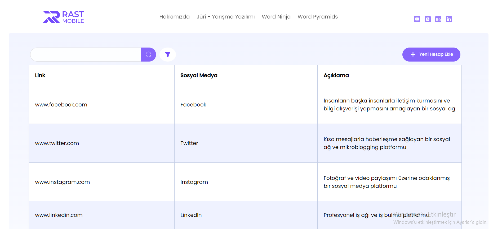
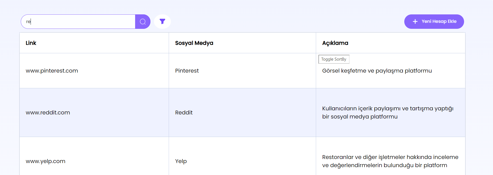
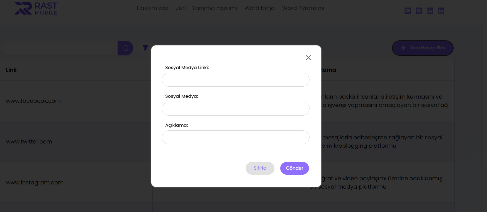
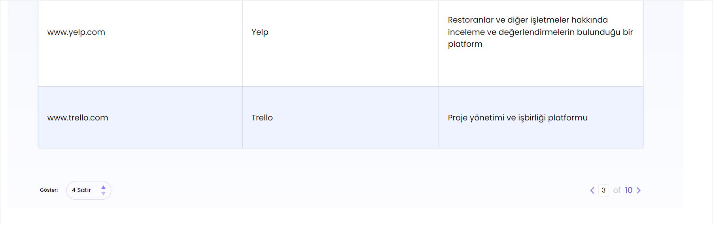
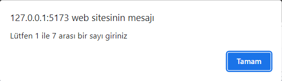
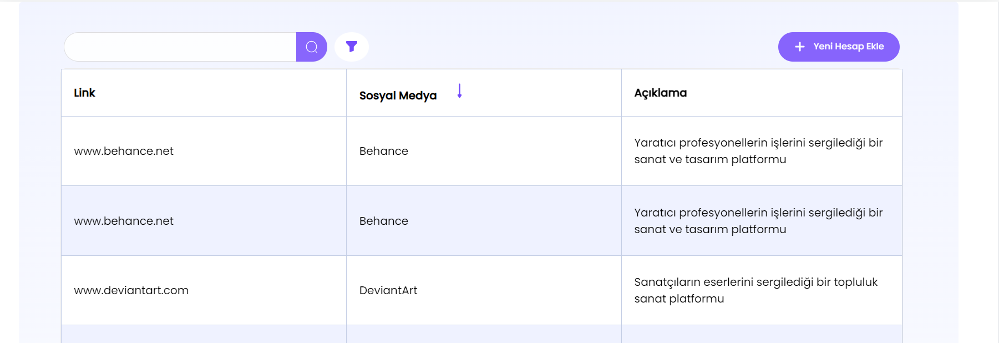

# Datagrid

### Bu proje, React ile geliştirilmiş bir DataGrid projesidir. Girilen sosyal medya bilgilerini belirli bir grid için'de rahatça gösterir ve bu dataları kişinin Localstorage'ına kayıt eder.




## Kullanım

- Sol üsteki arama kutsuna girilen değer ile data arası arama yapılabilir.





- Sağ üsteki "Yeni Hesap Ekle" butonuna tıklarsanız yeni sosyal medya girebilceğiniz loign paneli açılır.



- Sayfanın altındaki bölümler'de ise grid yapsının kaç satırlı olacağı ve sayfa numarasını seçebilirsiniz. Satır sayısı en fazla 8 en az 4 olabilir.



- Sayfa sayısıni belirleyen input bölümüne geçersiz bir değer girerseniz uyarı alırsınız.



- Sutün başlıklarına basarak gösterilen datayı o sutün verileri için alfabetik sıraya alabilirsiniz.



## Kullanılan Teknolojiler ve Bağımlılıklar

- Proje React.js kullanılar hazırlanmıştır.
- Styling için scss kullanılmıştır.
- Store yapısı için redux-toolkit tercil edilmiştir.
- Table yapısı için react-table kütüphanesi kullanılmıştır.

### Bağımlılıklar:

- @babel/runtime: ^7.22.5
- @reduxjs/toolkit: ^1.9.5
- react: ^18.2.0
- react-dom: ^18.2.0
- react-redux: ^8.1.0
- react-table: ^7.8.0
- regenerator-runtime: ^0.13.11

### Geliştirme Bağımlıkları:

- @types/react: ^18.0.37
- @types/react-dom: ^18.0.11
- @vitejs/plugin-react: ^4.0.0
- eslint: ^8.38.0
- eslint-plugin-react: ^7.32.2
- eslint-plugin-react-hooks: ^4.6.0
- eslint-plugin-react-refresh: ^0.3.4
- vite: ^4.3.9

## Kurulum

#### Bu adımlar, React DataGrid Projesi'nin yerel bir ortamda kurulumunu içerir.

- Ön Gereksinimler

Node.js'in yüklü olması gerekmektedir. Node.js'in en son sürümünü [buradan](https://nodejs.org/en) indirebilirsiniz.

### Kurulum Adımları
- Projeyi indirin veya kopyalayın:  
```
git clone https://github.com/kadirgurturk/datagrid.git
```
- Proje dizinine gidin:  
```
cd datagrid
```
- Bağımlılıkları Yükleyin: 
```
npm install
```
- Projeyi Başlatın: 
```
npm run dev
```

### Ek Komutlar
- Build: Projeyi üretim versiyonunu oluşturmak için : 
```
npm run build
```
- Lint: Proje dosyalarını eslint ile analiz etmek için aşağıdaki komutu kullanın:
```
npm run lint
```

## Proje Dizin Yapısı
```
-src/
    asset/
    component/
    css/
    data/
    readmeImg/
    reducers/
    sass/
    store/
    - App.jsx
    - index.css
    - main.jsx
- .eslintrc.cjs
- .gitignore
- index.html
- package-lock.json
- package.json
- Readme.md 
- vite.config.js    
```
Genel dizin yapısı bu şekilde dir.

- asset: Bu dizide componentler içinde kullnaılan img ve svg dosyaları tutulur. her bir dosya kullanıldığı componenet isimli klasör'de tutulur.
```
asset/
    downcontainer/
    grid/
    header/
    login/
    upcontainer/
```

- component : Proje içindeki tüm Component'lerin tutulduğu bölüm
```
    container/
        - Column.js      --------> React-table için gerekli sütun ayarlamalrını yapıldığı yer.
        - Container.jsx  --------> Grid, DownContainer, ve UpContianer kısımlarını içine alan bölüm.
        - Grid.jsx       --------> Grid yapısı burada bulunur.
    downcontainer/
        - DownContianer.jsx -----> Pagable ve Row componenetleri burada bulunur
        - Pageable.jsx    -------> Sayfanın sağ altında bulunan ve sayfa bumarasını belirleyen elementler burada bulunur.
        - Row.jsx         -------> Sayfanın sol altında bulunan ve grid yapısının satır sayısını ayarlayan elemanlar burada bulunur
    header/
        - Header.jsx       ------> Navbar kısmı.
        - MobileHeader.jsx  -----> Belirli bir genişliğin altında header.
    login/
        - Login.jsx         -----> Datayı eklediğimiz form kısmı burada bulunur.
    popup/
        - LoginPopup.jsx    -----> Login kısmı burada bulunur, Login componeneti popup gibi davranır.
    upcontainer/
        - Filter.jsx        -----> Dataları filtrelemek için input bulunur.
        - NewButton.jsx     -----> Yeni bir data girişi istendiğinde, login popup'ını açmak için button bulunur.
        - UpContainer.jsx   -----> Filter ve NewButton kısımları bulunur.
```

-css: scss ile derlenenen css dosyası bu klasörde tutulur. 
```
css/
    - app.css
    - app.css.map
```

- data: Burada datagrid'de göstereceğimiz data listesi ve data modal yapısı tutulur.
```
data/
   - DataList.js
   - DataModal.js
```
-readmeImg: Readme.md dosyasında kullanılan resimler saklanır.
```
readmeImg/

```
- reducers: Redux store için yazaılan reducer'lar bulunur.
```
reducers/
    - LoginOffReducer.js   -------> Login popup'ını açıp kapayan reducer.
    - PageNumberReducer.js  ------> Grid yapısının sayfa sayısını ayarlayan reducer.
    - RowNumberReducer.js  -------> Grid yapısının satır sayını tutar. 
    - TextReducer.js        ------> Global filter text'i alır.
```
- sass: Projeye ilişkin scss dosyaları burada tututlur.
```
sass/
       componenet/   ---> Component stylingleri burada bulunur.
       header/       ---> Header için styling burada bulunur
       popup/        ---> popup'lar için styleing bulunur.
    - _mixin.scss   ---> Hazır yazılmış css kodları bulunur.
    - _responsive   ---> Repsonsive dizayn için breakpointler bulunur. 
    - _variable.scss --> Projenin genel stil değişkenleri tututlur.(Renkler, font-size'lar vb.)
    - app.scss
```

- store: Genel store yapısı burada tutulur
```
store/
    - store.js

```
